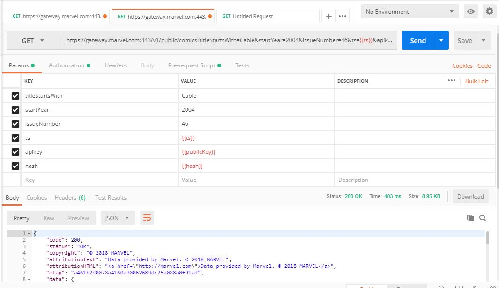

# Challengue C02

1. Get information related to the list of characters of Cable & Deadpool (2004) #46 (Zombie Variant).

   First of all we need to get the Comic ID, searching all the comics that starts with "Cable" and were created in 2004. To make the GET request we need to use a timestamp and Hash, for this we implement a Pre-request Script:

   ```javascript
   //Set the public Key
   var publicKey = "My Public Key";
   pm.environment.set("publicKey", publicKey);
   //Set Private Key
   var privateKey = "My Private Key";
   pm.environment.set("privateKey", privateKey);
   //Set the timestamp
   var time = Date.now().toString();
   pm.environment.set("ts", time);
   //Digest MD5
   var hash = CryptoJS.MD5(time+privateKey+publicKey).toString();
   pm.environment.set("hash", hash);
   ```

   After that the request is made

   ```
   https://gateway.marvel.com:443/v1/public/comics?titleStartsWith=Cable&startYear=2004&issueNumber=46&ts={{ts}}&apikey={{publicKey}}&hash={{hash}}
   ```

   

   And the Comic ID is 21845. Then we use the following request to get the [JSON File of the Characters](./characters.json)

   ```
   https://gateway.marvel.com:443/v1/public/comics/21845/characters?ts={{ts}}&apikey={{publicKey}}&hash={{hash}}
   ```

2. Get a list of all stories when Agent X (Nijo) appears

   In the Characters Json file we get the ID of Agent X : 1011031, then we use the following request to get the [JSON file of Agent X Stories](./agentXStories.json)

   ```
   https://gateway.marvel.com:443/v1/public/characters/1011031/stories?ts={{ts}}&apikey={{publicKey}}&hash={{hash}}
   ```
