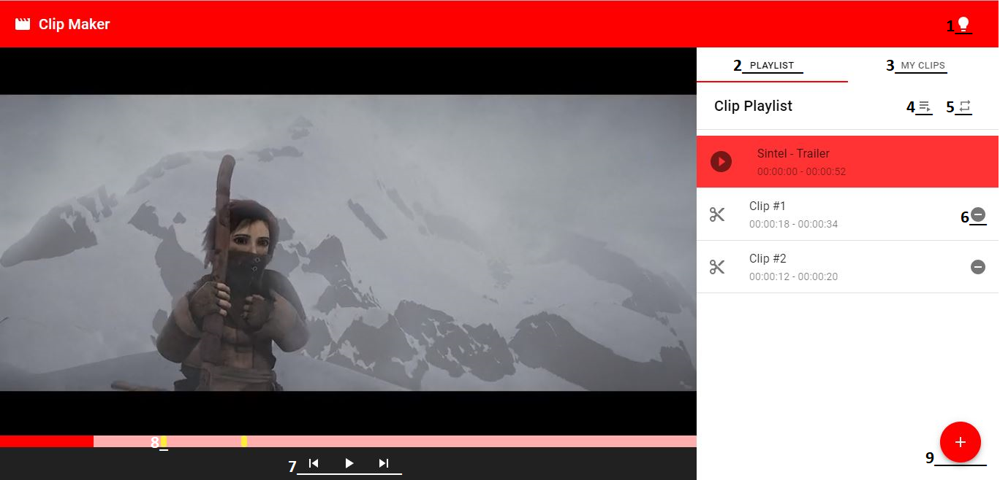
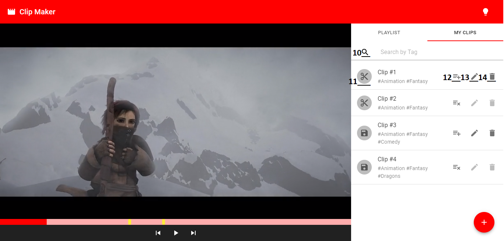

# Challenge C11

##### **Multimedia Challenge**

- An HTML5 video player that utilizes media fragments
- A list of clips to be played in the video player
- The first item in the list should be the full video
- An interface to add new clips to the list by specifying a name, start time, and end time
- The ability to delete clips from the list (excluding the full video item)
- The ability to edit existing clips in the list
- The ability to play clips in the video player
- The ability to automatically jump to the next clip after it finishes, with a 3 second waiting, use an appropriate loading animation.
- The ability to ‘save’ clips for persistent use.
- The ability to add arbitrary ‘tags’ to clips so that they can be filtered by the tag name.
- Hotkeys to jump between the current clip and next and previous clips (if there are any)
- Markers on the video player timeline that denote where a clip starts (full video only).
- Clicking the marker chooses that clip and plays it from that point.
- The ability to reuse the the player and playlist on another page without the editing capabilities

### Instructions

1. Install the dependencies and start the project

   ```bash
   npm install
   npm start
   ```


### User Guide

This guide is a quick descriptions of the options of the video player app.




1. Change the theme of the app (dark/light).
2. Tab with the playlist videos and options.
3. Tab with all the clips, if the url have the query "?embed=true", this tab is going to be disabled.
4. Autoplay: when a video ends, it waits 3 seconds and jump to the next video in the playlist (if any).
5. Restart: when the playlisy ends restart it from the beginning.
6. Remove a clip from the playlist.
7. Video controls: Play/Pause (alt + p), next (alt + n), previous (alt + b).
8. Clip Mark (Full video only): denote where a clip from the playlist start.
9. Add Clip: open a form to add a new clip, by default the new clip is automatically added to the playlist.




10. Search a clip by tag.
11. On click save the clip for persistent use (SessionStorage).
12. Add/remove a clip to the playlist, clips on the playlist cannot be edited or deleted.
13. Edit a clip, if the clip is saved for persistent use also change in the sessionStorage.
14. Delete a clip, if the is saved for persistent use also deleted from the sessionStorage. 